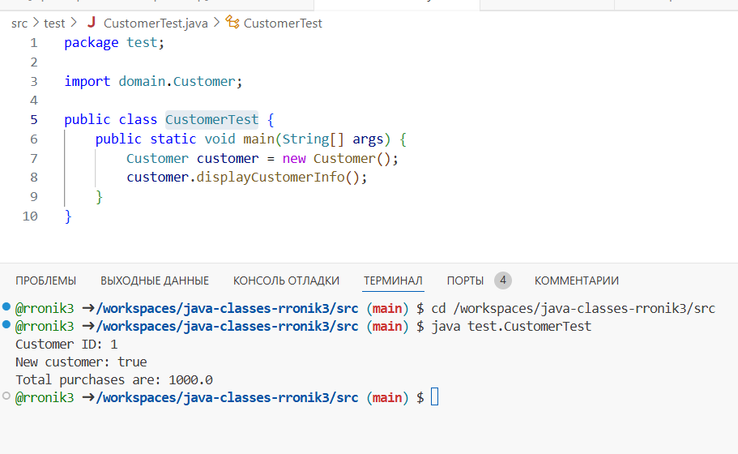
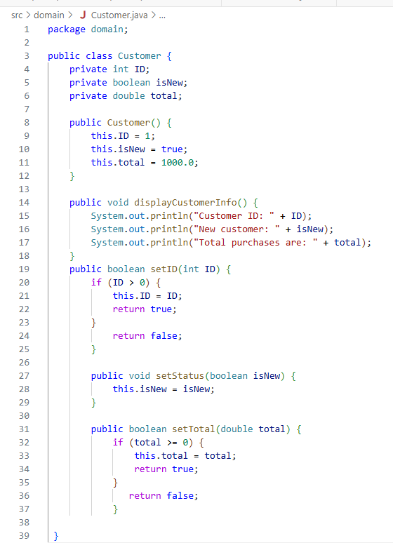
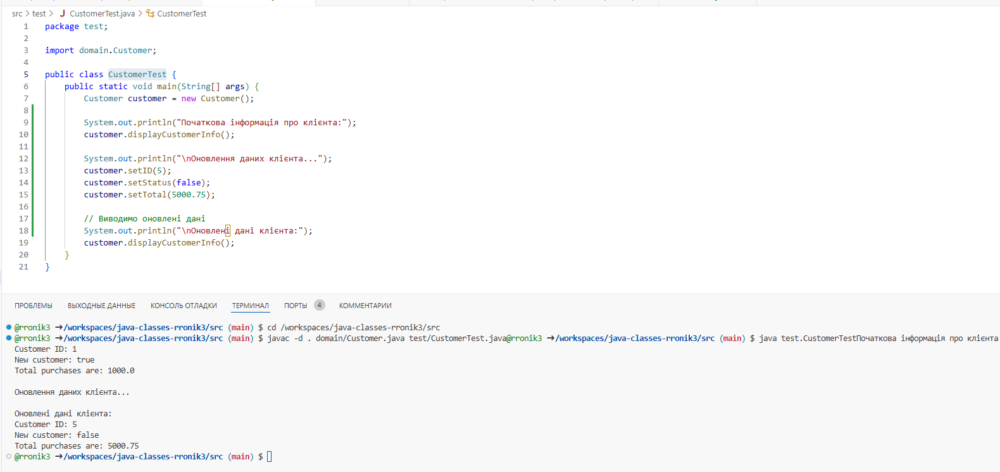

## Завдання 1. Створення класу з атрибутами

## Завдання 2. Додавання в клас методів 

## Перевірка працездатності створеного класу

#### Працююча програма

---
---
## Додати конструктор за замовчуванням, який ініціалізує атрибути початковими значеннями; Дати методи для зміни атрибутів - setID, setStatus, setTotal з відповідними параметрами та перевіркою присвоюваних значень
#### Оновлений Customer.java

#### Оновлений CustomerTest.java та результат

